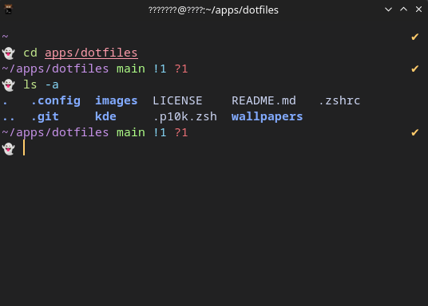

# dotfiles
A set of kitty, zsh and themes configuration files.

## Themes
All the themes I use
#### Material Theme Dark
 - [VSCode](https://github.com/material-theme/vsc-material-theme)
   
 - [KDE custom colors](./kde/color-schemes/MaterialThemeDark.colors)
    
    
 - [Kitty](./.config/kitty/kitty.conf) + [Powerlevel10k](https://github.com/romkatv/powerlevel10k#oh-my-zsh)
      

## Linux
  - Terminal - [Kitty](https://github.com/kovidgoyal/kitty) + [Zsh](https://www.zsh.org/) + [Oh my Zsh](https://github.com/ohmyzsh/ohmyzsh)
  - Icons - [Stylish Icon Theme](https://github.com/mjkim0727/Stylish-icon-theme)
